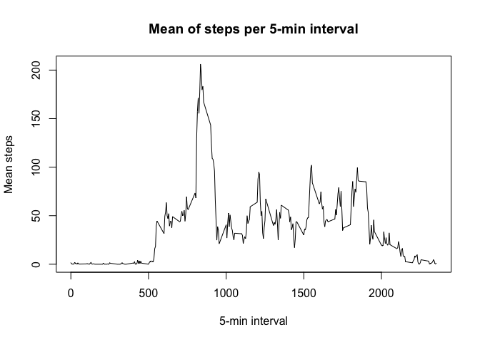

## Setup essential packages for analysis below


## Loading and preprocessing the data

```r
activity = read.table("activity.csv", header = T, na.strings = "NA", sep = ",")
activity$date = ymd(activity$date)
activity$interval = str_pad(activity$interval, width = 4, side = "left", pad = "0")
activity$datetime = ymd_hm(paste(activity$date, activity$interval))
str(activity)
```

```
## 'data.frame':	17568 obs. of  4 variables:
##  $ steps   : int  NA NA NA NA NA NA NA NA NA NA ...
##  $ date    : Date, format: "2012-10-01" "2012-10-01" ...
##  $ interval: chr  "0000" "0005" "0010" "0015" ...
##  $ datetime: POSIXct, format: "2012-10-01 00:00:00" "2012-10-01 00:05:00" ...
```

## What is mean total number of steps taken per day?
1. Sum of all steps per day

```r
sum.act = aggregate(activity$steps, by = list(activity$date), FUN=sum, na.rm = T)
names(sum.act) = c("date", "totalsteps")
```
2. Histogram of total number of steps per day

```r
hist(sum.act$totalsteps, main = "Total number of steps per day", xlab = "Number of steps per day")
```

<!-- -->

3. Mean and Median of total number of steps per day

```r
print(paste0("Mean: ",mean(sum.act$totalsteps), " ; Median: ", median(sum.act$totalsteps)))
```

```
## [1] "Mean: 9354.22950819672 ; Median: 10395"
```
## What is the average daily activity pattern?
1. Time Series Plot: Mean of steps per 5-min interval

```r
mean.intact = aggregate(activity$steps, by = list(activity$interval), FUN=mean, na.rm = T)
names(mean.intact) = c("int", "meanact")
plot(mean.intact$int, mean.intact$meanact, type = "l", main = "Mean of steps per 5-min interval", xlab = "5-min interval", ylab = "Mean steps")
```

<!-- -->
2. Maximum number of steps on average

```r
print(paste0("Maximum number of steps on average is in ", mean.intact$int[which.max(mean.intact$meanact)], " hrs."))
```

```
## [1] "Maximum number of steps on average is in 0835 hrs."
```

## Imputing missing values
1. Count number of NA

```r
summary(activity)
```

```
##      steps             date              interval        
##  Min.   :  0.00   Min.   :2012-10-01   Length:17568      
##  1st Qu.:  0.00   1st Qu.:2012-10-16   Class :character  
##  Median :  0.00   Median :2012-10-31   Mode  :character  
##  Mean   : 37.38   Mean   :2012-10-31                     
##  3rd Qu.: 12.00   3rd Qu.:2012-11-15                     
##  Max.   :806.00   Max.   :2012-11-30                     
##  NA's   :2304                                            
##     datetime                  
##  Min.   :2012-10-01 00:00:00  
##  1st Qu.:2012-10-16 05:58:45  
##  Median :2012-10-31 11:57:30  
##  Mean   :2012-10-31 11:57:30  
##  3rd Qu.:2012-11-15 17:56:15  
##  Max.   :2012-11-30 23:55:00  
## 
```

2. Fill in NA values with interval mean and
3. Creation of new dataset

```r
activity2 = activity
for(i in 1:nrow(activity2)) {
  if (is.na(activity2[i,1])) {
    activity2[i,1] = mean.intact[match(activity2[i,3], mean.intact$int),2]
  }
}
```
Sum of all steps per day after imputing missing

```r
sum.act2 = aggregate(activity2$steps, by = list(activity2$date), FUN=sum, na.rm = T)
names(sum.act2) = c("date", "totalsteps")
```
4. Histogram of total number of steps per day imputing missing

```r
hist(sum.act2$totalsteps, main = "Total number of steps per day after imputing missing", xlab = "Number of steps per day")
```

<!-- -->

Mean and Median of total number of steps per day imputing missing

```r
print(paste0("Old Mean: ",round(mean(sum.act$totalsteps), 2), " ; Old Median: ", median(sum.act$totalsteps)))
```

```
## [1] "Old Mean: 9354.23 ; Old Median: 10395"
```

```r
print(paste0("New Mean: ",round(mean(sum.act2$totalsteps), 2), " ; New Median: ", round(median(sum.act2$totalsteps))))
```

```
## [1] "New Mean: 10766.19 ; New Median: 10766"
```
## Are there differences in activity patterns between weekdays and weekends?

1. Recoding weekday variable

```r
activity2$weekday = wday(activity2$date, label = FALSE)
activity2$weekday = ifelse(activity2$weekday <= 5, "weekday", "weekend")
activity2$weekday = as.factor(activity2$weekday)
```
2. Mean of intervals by weekend and weekday

```r
meanwk = activity2 %>%
  group_by(weekday, interval) %>%
  summarise(mean = mean(steps))
```

```
## `summarise()` regrouping output by 'weekday' (override with `.groups` argument)
```
Comparison plot
Histogram of total number of steps per day imputing missing

```r
ggplot(meanwk, aes(x=interval, y=mean, group = 1)) + geom_line() +
    facet_grid(rows = vars(weekday)) + xlab("5-mins Interval") + ylab("Mean Steps") +
    ggtitle("Walking patterns by time of week") + scale_x_discrete(breaks  = c("0000", "0600", "1200","1800","2400"))
```

<!-- -->
